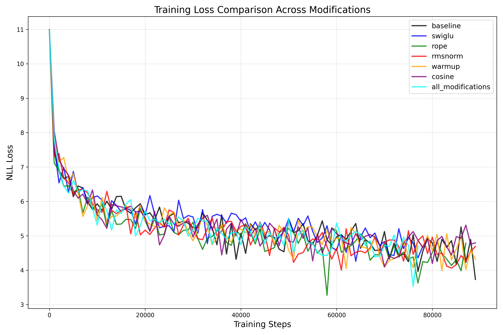
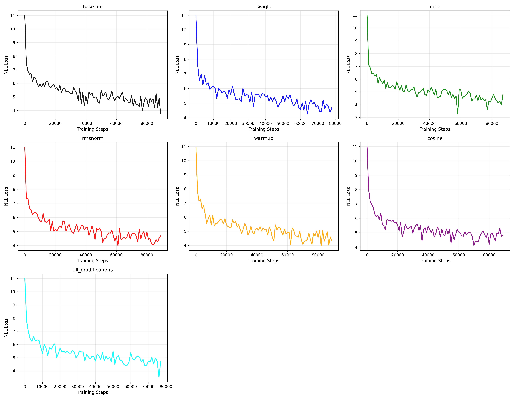

# Attention Wasn't All We Needed on minGPT

[](https://pytorch.org/)
[](https://arxiv.org/abs/1706.03762)
[](https://developer.nvidia.com/cuda-zone)
[](https://github.com/karpathy/minGPT)

> Architecturally enhanced implementation of [minGPT](https://github.com/karpathy/minGPT) by Andrej Karpathy, incorporating modern transformer optimizations from Stephen Diehl's ["Attention Wasn't All We Needed"](https://www.stephendiehl.com/posts/post_transformers/).

## Overview

This project implements modern transformer optimizations from scratch by modifying minGPT's core architecture at the source-code level. The goal was to gain a deeper understanding of transformer architectures by translating Stephen Diehl's ["Attention Wasn't All We Needed"](https://www.stephendiehl.com/posts/post_transformers/) article into working code and systematically evaluating the impact of each technique.

Implemented modifications include **Rotary Positional Embeddings (RoPE)**, **SwiGLU activation**, **RMSNorm**, and two learning rate scheduling strategies (**Linear Warmup** and **Cosine Annealing**). Training was performed on The Pile dataset using a custom JSONL data loader with GPT-2 BPE tokenization.

**Key Finding**: RoPE delivered the strongest individual performance improvement. All architectural modifications showed better performance than baseline, though interesting interactions emerged when combining multiple techniques.

---

## Architectural Modifications (The Engine Room)

This project implements modern transformer optimizations from scratch, modifying minGPT's core architecture at the source-code level. All modifications are controlled via configuration flags, enabling systematic ablation studies.

### What Was Implemented

**Rotary Positional Embeddings (RoPE)** - [model.py:21-88](mingpt/model.py#L21-L88)
- Custom `RotaryEmbedding` module generating sinusoidal position encodings
- Applied rotation to Q/K tensors in attention mechanism before score computation
- Removed learned positional embeddings (`wpe`) when RoPE is enabled
- Handles multi-head attention broadcasting and sequence length variations

**SwiGLU Activation** - [model.py:90-119](mingpt/model.py#L90-L119)
- Gated linear unit with SiLU activation replacing standard GELU in MLP blocks
- Three linear projections (w1, w2, w3) with element-wise gating
- Maintains 4x hidden dimension expansion matching GPT-2 architecture
- Conditional replacement in `Block` class via `use_swiglu` flag

**RMSNorm** - [model.py:186-261](mingpt/model.py#L186-L261)
- Simplified normalization replacing LayerNorm throughout the model
- Applied at pre-attention, pre-MLP, and final layer positions
- Weight decay blacklisting to prevent training instabilities
- Drop-in replacement via `use_rmsnorm` configuration flag

**Learning Rate Schedulers** - [trainer.py:15-50](mingpt/trainer.py#L15-L50)

Two distinct scheduling strategies implemented as separate techniques:

1. **Linear Warmup Only** (`LinearWarmupScheduler`): Gradual ramp from 0 → base_lr over 1,000 steps, then maintains constant learning rate
2. **Cosine Annealing with Warmup** (`CosineAnnealingWarmupScheduler`): Linear warmup phase followed by cosine decay to minimum learning rate over remaining training iterations

Both implemented as PyTorch `_LRScheduler` subclasses for systematic comparison

---

## What I Learned

### Understanding Transformer Architectures at a Deeper Level

Implementing these modifications from scratch provided hands-on insight into how transformers actually work under the hood. Reading research papers and blog posts is one thing; translating them into working PyTorch code that integrates with an existing architecture is entirely different.

### Translating Research into Code

Papers often omit critical implementation details—tensor shapes, broadcasting semantics, when exactly to apply transformations in the forward pass. Successfully implementing RoPE, SwiGLU, and RMSNorm required piecing together information from multiple sources and debugging until it worked.

### The Value of Systematic Experimentation

Running ablation studies revealed which modifications genuinely improve performance versus which sound good in theory but fail in practice. Not all "best practices" from large-scale models transfer to smaller scales, and combining techniques doesn't guarantee cumulative benefits.

### Loss Improvements Validate the Approach

Seeing measurable loss reductions confirmed that these architectural choices matter. The systematic comparison provided concrete evidence about what works and what doesn't, rather than relying on intuition or anecdotal claims

---

## Training Results

### Loss Curves: All Experimental Configurations



**Loss evolution over ~90,000 iterations** comparing all 7 configurations. RoPE and RMSNorm demonstrate consistently lower loss trajectories, while the combined "All Modifications" configuration reveals interesting interaction effects between individual techniques.

### Individual Method Comparison



**3×3 grid visualization** showing each modification's training dynamics in isolation. Enables direct comparison of convergence behavior and final loss values across all ablation experiments.

---

## Experimental Methodology

### Implementation Approach

The architecture uses modular design patterns enabling clean ablations:

```python
# Conditional component replacement
self.ln_1 = nn.RMSNorm(config.n_embd) if config.use_rmsnorm else nn.LayerNorm(config.n_embd)
self.mlpf = SwiGLU(config.n_embd) if config.use_swiglu else standard_mlp

# Conditional execution in forward pass
if self.config.use_rope:
    cos, sin = self.rotary_emb(T, device=x.device)
    q, k = apply_rotary_pos_emb(q, k, cos, sin)
```

This design allowed independent testing of each modification through command-line flags (`-r`, `-s`, `-n`, `-w`, `-c`, `-a`), producing the systematic comparison shown in the results below

### Training Configuration

- **Model Architecture**: GPT-2 (minGPT baseline)
- **Learning Rate**: 5e-6
- **Batch Size**: 16
- **Context Length**: 512 tokens
- **Training Duration**: ~90,000 iterations (target: 175,000)
- **Dataset**: The Pile (first 50,000 lines, JSONL format)
- **Train/Test Split**: 49,000 / 1,000
- **Tokenizer**: GPT-2 BPE (vocab size: 50,257)
- **Warmup Steps**: 1,000 (when enabled)
- **Compute**: SLURM cluster with single GPU per job

### Experimental Design: Seven Ablation Studies

1. **Baseline** (`-b`): No modifications (vanilla GPT-2)
2. **RoPE** (`-r`): Rotary positional embeddings only
3. **SwiGLU** (`-s`): SwiGLU activation only
4. **RMSNorm** (`-n`): RMS normalization only
5. **Warmup** (`-w`): Linear warmup only
6. **Cosine** (`-c`): Linear warmup + cosine decay
7. **All Modifications** (`-a`): All features enabled

### Reproducibility

**Command-line flags** ([lab4.py](lab4.py)) enable individual modifications:

```bash
# Baseline
python lab4.py -b

# Individual modifications
python lab4.py -r  # RoPE
python lab4.py -s  # SwiGLU
python lab4.py -n  # RMSNorm
python lab4.py -w  # Warmup
python lab4.py -c  # Cosine scheduler

# All modifications
python lab4.py -a
```

**Batch execution** for systematic experimentation:

```bash
bash run_all.sh  # Submits all 7 experiments to SLURM
```

**Logging**:
- Loss logged every 1,000 iterations → `losses/{experiment_name}.csv`
- Checkpoints saved every 25,000 iterations → `checkpoints/{experiment_name}/`

---

## Repository Structure

```
custom_mingpt/
├── mingpt/
│   ├── model.py           # Core architecture: RoPE, SwiGLU, RMSNorm
│   ├── trainer.py         # Training loop with LR schedulers
│   ├── utils.py           # Utilities and helper functions
│   └── bpe.py             # GPT-2 BPE tokenizer
├── dataloader.py          # Custom JSONL dataset loader for The Pile
├── lab4.py                # Main training script with CLI flags
├── plotter.py             # Visualization generation (loss curves, grids)
├── run_all.sh             # Batch experiment submission (SLURM)
├── run_single.sh          # SLURM job template
├── losses/                # Training metrics (CSV files)
│   ├── baseline.csv
│   ├── rope.csv
│   ├── swiglu.csv
│   ├── rmsnorm.csv
│   ├── warmup.csv
│   ├── cosine.csv
│   └── all_modifications.csv
├── visualizations/        # Generated plots
│   ├── training_comparison.png
│   ├── individual_grid.png
│   └── *.png (individual experiment plots)
├── checkpoints/           # Model checkpoints (saved every 25K iters)
└── README.md              # This file
```

---

## Getting Started

### Installation

```bash
# Clone the repository
git clone <repository-url>
cd custom_mingpt

# Install dependencies
pip install torch numpy tiktoken
```

### Training

#### Run Individual Experiments

```bash
# Baseline (no modifications)
python lab4.py -b

# Individual modifications
python lab4.py -r  # RoPE only
python lab4.py -n  # RMSNorm only
python lab4.py -s  # SwiGLU only
python lab4.py -w  # Warmup only
python lab4.py -c  # Cosine scheduler only

# Combinations
python lab4.py -r -n -w  # RoPE + RMSNorm + Warmup
python lab4.py -a         # All modifications
```

#### Batch Execution (SLURM)

```bash
# Submit all 7 experiments to SLURM
bash run_all.sh
```

### Visualization

```bash
# Generate training curves and comparison plots
python plotter.py
```

Output saved to `visualizations/`:
- `training_comparison.png` - All experiments overlaid
- `individual_grid.png` - 3×3 grid of individual plots
- Individual plots per experiment

---

## References

- **Andrej Karpathy**: [minGPT](https://github.com/karpathy/minGPT) - The original implementation this project builds upon
- **Stephen Diehl**: [Attention Wasn't All We Needed](https://www.stephendiehl.com/posts/post_transformers/) - Blog post motivating these architectural modifications
- **Vaswani et al. (2017)**: [Attention Is All You Need](https://arxiv.org/abs/1706.03762) - The original transformer paper
